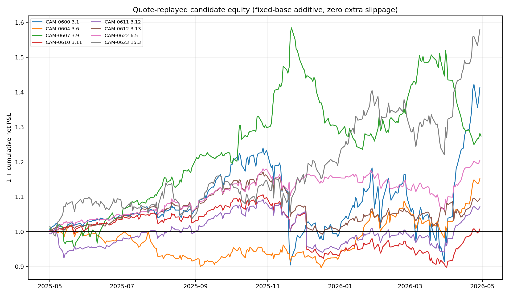

# SSRN 3247865 — 25-strategy S&P 500, QQQ, and ETF research series

## Executive conclusion

All 25 requested sections of *151 Trading Strategies* were source-contracted, implemented on applicable point-in-time S&P 500, point-in-time QQQ, and ETF data, adapted through broad mechanism-driven grids, audited chronologically inside development, and execution-gated where applicable. No May 2026-or-later data was loaded, no broker margin was used, and no strategy is promoted.

Final status counts: `{"execution_sensitive_unpromoted": 3, "profitable_but_fragile_unpromoted": 3, "promising_unpromoted_candidate": 2, "retired_mechanism_exhausted": 4, "retired_quote_execution_failure": 11, "stopped_nonexecutable_short_signal": 2}`.

The strongest marketable-quote results were CAM-0600 ETF momentum, CAM-0622 QQQ/BIL volatility targeting, CAM-0623 safest-distress at a delayed 09:40 entry, and CAM-0607 daily ETF cluster reversal. None delivered the requested smooth +5% month-after-month profile: the first two averaged less than 5% monthly in the quote window, safest-distress was positive in only 6/12 months, and cluster reversal's 5m/15m implementations failed decisively.

## Per-strategy disposition

| Campaign | Section | Strategy | Adapted 2 bp net | Quote net | Quote +2 bp | Quote months +/− | Final |
|---|---:|---|---:|---:|---:|---:|---|
| CAM-0600 | 3.1 | Price momentum | +295.2% | +41.4% | +31.4% | 9/3 | `promising_unpromoted_candidate` |
| CAM-0601 | 3.2 | Earnings momentum | +91.4% | -14.0% | -24.0% | 3/9 | `retired_quote_execution_failure` |
| CAM-0602 | 3.3 | Value | +513.2% | -26.2% | -36.2% | 4/8 | `retired_quote_execution_failure` |
| CAM-0603 | 3.4 | Low-volatility anomaly | +405.4% | -39.4% | -49.4% | 3/9 | `retired_quote_execution_failure` |
| CAM-0604 | 3.6 | Multifactor portfolio | +519.4% | +15.2% | +5.2% | 7/5 | `profitable_but_fragile_unpromoted` |
| CAM-0605 | 3.7 | Residual momentum | +63.9% | -26.2% | -36.2% | 4/8 | `retired_quote_execution_failure` |
| CAM-0606 | 3.8 | Pairs trading | n/a | n/a | n/a | n/a | `retired_mechanism_exhausted` |
| CAM-0607 | 3.9 | Single-cluster mean reversion | +234.3% | +27.4% | +17.4% | 8/4 | `profitable_but_fragile_unpromoted` |
| CAM-0608 | 3.9.1 | Multiple-cluster mean reversion | -6.2% | n/a | n/a | n/a | `retired_mechanism_exhausted` |
| CAM-0609 | 3.10 | Weighted-regression mean reversion | -20.7% | n/a | n/a | n/a | `retired_mechanism_exhausted` |
| CAM-0610 | 3.11 | Single moving average | +79.9% | +0.8% | -9.2% | 8/4 | `execution_sensitive_unpromoted` |
| CAM-0611 | 3.12 | Two moving averages | +110.4% | +7.2% | -2.8% | 8/4 | `execution_sensitive_unpromoted` |
| CAM-0612 | 3.13 | Three moving averages | +102.4% | +9.5% | -0.5% | 9/3 | `execution_sensitive_unpromoted` |
| CAM-0613 | 3.14 | Support and resistance | -21.8% | n/a | n/a | n/a | `retired_mechanism_exhausted` |
| CAM-0614 | 3.15 | Donchian channel | +82.3% | -27.8% | -37.8% | 4/8 | `retired_quote_execution_failure` |
| CAM-0615 | 3.18 | Statistical-arbitrage optimization | +65.6% | -26.4% | -36.3% | 4/8 | `retired_quote_execution_failure` |
| CAM-0616 | 3.18.1 | Dollar-neutral statistical-arbitrage optimization | n/a | n/a | n/a | n/a | `stopped_nonexecutable_short_signal` |
| CAM-0617 | 3.20 | Alpha combos | n/a | n/a | n/a | n/a | `stopped_nonexecutable_short_signal` |
| CAM-0618 | 4.1 | Sector momentum rotation | +176.4% | -1.5% | -11.5% | 7/5 | `retired_quote_execution_failure` |
| CAM-0619 | 4.1.1 | Sector momentum with moving-average filter | +112.8% | -12.1% | -22.0% | 7/5 | `retired_quote_execution_failure` |
| CAM-0620 | 4.1.2 | Dual-momentum sector rotation | +111.7% | -13.9% | -23.9% | 7/5 | `retired_quote_execution_failure` |
| CAM-0621 | 4.4 | ETF IBS mean reversion | +25.5% | -5.4% | -15.0% | 6/6 | `retired_quote_execution_failure` |
| CAM-0622 | 6.5 | Index volatility targeting with risk-free asset | +101.3% | +20.5% | +10.5% | 8/4 | `promising_unpromoted_candidate` |
| CAM-0623 | 15.3 | Distress risk puzzle | +111.4% | +58.0% | +48.0% | 6/6 | `profitable_but_fragile_unpromoted` |
| CAM-0624 | 15.3.1 | Distress risk puzzle risk management | +56.5% | -27.8% | -35.7% | 2/10 | `retired_quote_execution_failure` |

## Execution evidence

The quote gate used 84,838 candidate position-days and 96,349 deduplicated roles in the complete local-quote window, 2025-05-01 through 2026-04-30. Exact cutoff-bounded Alpaca SIP role pulls filled 99.92% of 09:30 roles after bounded expansion. Execution-sensitive rejected variants were retried at 09:40; the final delayed replay filled all but a very small set of halted or quote-sparse roles, and incomplete campaigns are explicitly labeled.

The replay is deliberately conservative: every active day is reset at a marketable ask and bid, so multi-day portfolios pay the spread daily. This avoids an optimistic passive-touch assumption but can understate a true hold-shares implementation. Delayed entries are separate adapted evidence, not source baselines.

## Important limitations

- The S&P 500 point-in-time reconstruction is provisional and has documented disagreement with a secondary reconstruction; S&P-only conclusions are correspondingly weaker.
- SUE was repaired with filing-causal SEC diluted EPS; fourth-quarter EPS is annual diluted EPS less the first three direct quarters and is disclosed as an approximation.
- The distress score uses published CHS coefficients with an annual accounting proxy, not a perfect quarterly NIMTAAVG replication.
- RUN-0001 for 3.18/3.18.1 used a diagonal diagnostic; RUN-0002 repaired source fidelity with a full shrinkage covariance implementation. Overnight dollar-neutral short results remain signal-only.
- All chronological and quote evidence is still development data. The sealed holdout remains untouched, so even the strongest candidates require frozen forward paper confirmation.

## Reproducibility index

- Source contract: `campaigns/CAM-0600/SOURCE_CONTRACT.yaml`
- Readiness and fundamental provenance: `campaigns/CAM-0600/artifacts/shared/`
- Full baseline/adaptation/robustness/quote tables: `campaigns/CAM-0600/artifacts/shared/`
- Per-campaign run records, daily/monthly/yearly/symbol outputs: `campaigns/CAM-0600` through `CAM-0624`
- Source PDF: `C:/Users/decla/Downloads/ssrn-3247865.pdf`
