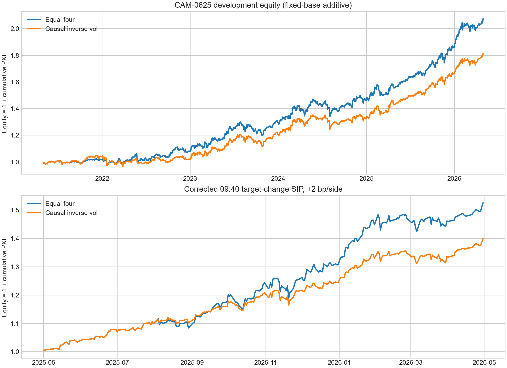
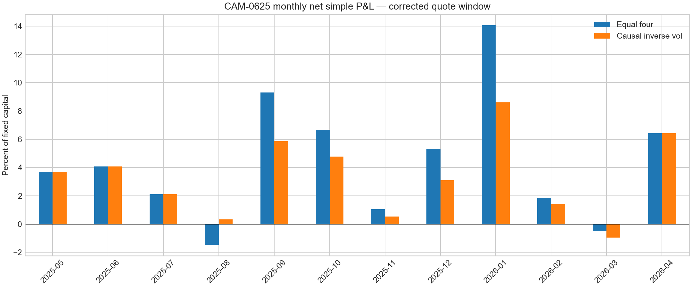

# SSRN 3247865 deep development checkpoint

## Executive conclusion

All 25 requested sections of *151 Trading Strategies* were re-read, rebuilt or
repaired, and challenged through a second development loop on applicable
point-in-time S&P 500, point-in-time QQQ, and declared ETF data. The work added
1,000+ prespecified variant definitions across broad parameter neighborhoods,
six cost assumptions, recent 12/15/18-month diagnostics, matched simpler
controls, selection attrition, concentration, daily entry-delay stress, and
corrected SIP quote replay.

The prior report's execution verdict was wrong for multi-day portfolios because
it charged a full ask-to-bid round trip every active day. RUN-0009/RUN-0011 now
replay only actual target-weight changes. A second defect was caught before
interpretation: split-adjusted ETF bars were compared with raw SIP quotes. The
invalid outputs are preserved with `INVALID_SPLIT_REFERENCE` labels; all valid
replay uses the contemporaneous 09:30 SIP midpoint as the common reference.

The corrected result is not “nothing works.” Several individual sleeves are
strong in the latest 12 months, and a simple ensemble is unusually smooth.
However, every result remains adapted development evidence. The latest period
is at or near the top historical percentile, the strategy-selection process is
large, and no May 2026-or-later sealed data was accessed. Nothing is promoted.

## Best current expression: CAM-0625

CAM-0625 combines four whole, low-correlation mechanisms without ticker
selection: panic-aware S&P momentum (CAM-0600), broad S&P multifactor
(CAM-0604), multi-day ETF IBS (CAM-0621), and volatility-managed safest-distress
(CAM-0624). Each sleeve receives 25% in the simplest version. A causal
inverse-volatility version uses only 126 prior sessions and rebalances monthly.

| Evidence | Rule | Net additive return | Max drawdown | Months +/− | Worst month | Best month | Top-five positive-day share |
|---|---|---:|---:|---:|---:|---:|---:|
| 2021-05-03 to 2026-04-30, sleeve paths at 2 bp | Equal four | +107.4% | 9.0% | 38/22 | -4.4% | +14.1% | 4.1% |
| 2021-05-03 to 2026-04-30, sleeve paths at 2 bp | Causal inverse vol | +81.3% | 8.1% | 38/22 | -4.4% | +8.5% | 3.9% |
| 2025-05-01 to 2026-04-30, exact 09:40 SIP plus 2 bp/side | Equal four | +52.6% | 5.6% | 10/2 | -1.5% | +14.1% | 12.5% |
| 2025-05-01 to 2026-04-30, exact 09:40 SIP plus 2 bp/side | Causal inverse vol | +40.0% | 4.3% | 11/1 | -1.0% | +8.6% | 11.6% |
| Same quote window, 10 bp additional per side | Equal four | +49.9% | 5.7% | 10/2 | -1.7% | +13.8% | 12.6% |
| Same quote window, 10 bp additional per side | Causal inverse vol | +37.5% | 4.4% | 11/1 | -1.2% | +8.4% | 11.8% |

Every 09:40/10-bp leave-one-sleeve-out path stayed profitable. Removing
momentum cut equal-weight return to +26.0%; removing multifactor, IBS, or
distress raised raw return but worsened path diversification. The four-sleeve
portfolio therefore does not require a single component for profitability,
though momentum is the main recent income engine.

A fifth CAM-0617 alpha-combo sleeve raised equal-weight quote return to +54.9%
and reduced drawdown to 4.8% at 2 bp extra, but worsened full-history drawdown
to 11.4% and is dominated by leveraged ETF SOXL. It is a tactical satellite,
not part of the cleaner four-sleeve core.

## Regime and fragility diagnosis

The latest period is exceptional. Equal four-sleeve recent 12-, 18-, and
24-month returns are all at the 100th percentile of their available rolling
history. The chronological fold returns were +8.0%, +32.0%, and +67.4%; causal
inverse-volatility returned +2.0%, +27.8%, and +51.5%. This is consistent with a
recent regime acceleration, not a timeless 4%-to-5%-per-month machine.

The equal portfolio was positive in every available rolling 12-month window;
the causal inverse-volatility portfolio was positive in 93.9% of them. A
20,000-draw resample of the 60 development months gave a 96.7% descriptive
probability of a positive 12-month equal-weight sum and 94.5% for inverse vol.
These are dependence-ignoring development diagnostics, not formal p-values or
out-of-sample probabilities.

A stricter 20,000-draw circular block bootstrap used 21-session blocks to
construct 252-session paths. Equal weight had +2.5% at the 5th return
percentile, 13.3% drawdown at the 95th percentile, and 0.29% of paths above
20% drawdown. Causal inverse vol had +0.6%, 12.3%, and 0.16%, respectively.
At the 1st return percentile both rules lost about 5%–6%. These are descriptive
stationary-mixture stresses, not forecasts or formal confidence intervals.

The frozen six-month activation rule (prior six completed months positive with
at least four green months) was active throughout the quote year and did not
improve it. The stricter 12-month rule missed three profitable months. A causal
retirement monitor is still sensible—deactivate after the responsive six-month
condition fails—but it should be viewed as risk governance, not historical
return enhancement.

With one and two additional session delays, plus 10 bp per side, the equal
ensemble still returned +80.6% and +75.8% over the common history. Momentum,
multifactor, and distress survived. IBS fell from +106.9% at one extra day/2 bp
to +12.6% at two extra days/10 bp, confirming that IBS is the
execution-sensitive diversification sleeve.

## Individual strategy evidence

The quote column is corrected 09:40 target-change SIP replay with 2 bp of
additional adverse slippage per side. Full and recent columns use the selected
development path at 2 bp per side. They are selection-biased and should not be
compared as independent discoveries.

| Campaign | Section | Strategy | Full net | Recent 12m | Quote net | Quote DD | Months +/− | Top-five day share |
|---|---:|---|---:|---:|---:|---:|---:|---:|
| CAM-0600 | 3.1 | Price momentum | +218.8% | +123.3% | +123.1% | 13.5% | 11/1 | 13.5% |
| CAM-0601 | 3.2 | Earnings momentum | +122.0% | +43.0% | +42.4% | 14.3% | 8/4 | 11.9% |
| CAM-0602 | 3.3 | Value | +167.0% | +82.9% | +82.0% | 10.4% | 10/2 | 13.9% |
| CAM-0603 | 3.4 | Low volatility | +85.2% | +26.2% | +26.0% | 7.0% | 8/4 | 10.6% |
| CAM-0604 | 3.6 | Multifactor | +72.8% | +41.9% | +42.2% | 5.2% | 11/1 | 11.3% |
| CAM-0605 | 3.7 | Residual momentum | +115.9% | +30.3% | +28.4% | 22.5% | 9/3 | 15.5% |
| CAM-0606 | 3.8 | Pairs trading | n/a | n/a | n/a | n/a | n/a | n/a |
| CAM-0607 | 3.9 | Single-cluster mean reversion | +304.9% | +78.7% | +25.1% | 30.0% | 8/4 | 20.4% |
| CAM-0608 | 3.9.1 | Multiple-cluster mean reversion | +144.9% | +29.1% | +27.1% | 32.7% | 8/4 | 16.0% |
| CAM-0609 | 3.10 | Weighted-regression mean reversion | +126.6% | +25.6% | +24.7% | 13.8% | 8/4 | 14.6% |
| CAM-0610 | 3.11 | Single moving average | +300.2% | +116.3% | +116.8% | 12.9% | 9/3 | 14.9% |
| CAM-0611 | 3.12 | Two moving averages | +308.0% | +120.2% | +121.9% | 12.4% | 9/3 | 14.8% |
| CAM-0612 | 3.13 | Three moving averages | +178.1% | +98.2% | +94.8% | 15.8% | 8/4 | 14.5% |
| CAM-0613 | 3.14 | Support and resistance | n/a | n/a | n/a | n/a | n/a | n/a |
| CAM-0614 | 3.15 | Channel | +48.8% | +11.6% | +8.9% | 7.5% | 8/4 | 12.9% |
| CAM-0615 | 3.18 | Stat-arb optimization | +131.7% | +32.6% | +33.0% | 7.0% | 9/3 | 12.5% |
| CAM-0616 | 3.18.1 | Dollar-neutral optimization | +131.0% | +33.3% | +33.9% | 7.4% | 9/3 | 12.4% |
| CAM-0617 | 3.20 | Alpha combos | +196.0% | +58.9% | +64.3% | 15.7% | 9/3 | 22.7% |
| CAM-0618 | 4.1 | Sector momentum rotation | +111.6% | +25.2% | +26.4% | 5.6% | 11/1 | 10.6% |
| CAM-0619 | 4.1.1 | Sector momentum with MA filter | +130.0% | +36.9% | +39.5% | 10.0% | 8/4 | 11.4% |
| CAM-0620 | 4.1.2 | Dual-momentum sector rotation | +117.9% | +34.5% | +35.9% | 9.3% | 8/4 | 13.8% |
| CAM-0621 | 4.4 | ETF IBS mean reversion | +153.6% | +23.4% | +27.7% | 4.9% | 7/5 | 17.8% |
| CAM-0622 | 6.5 | Index volatility targeting | +116.2% | +18.3% | +18.0% | 9.4% | 8/4 | 12.7% |
| CAM-0623 | 15.3 | Distress risk puzzle | +144.8% | +77.8% | +76.2% | 9.7% | 9/3 | 12.4% |
| CAM-0624 | 15.3.1 | Distress risk management | +50.5% | +17.8% | +17.5% | 3.7% | 9/3 | 12.2% |

CAM-0606 proper predefined economic pairs and CAM-0613 causal pivot rules
failed the 10-bp structured screen after repair. They are the only two families
without a selected deep survivor.

## Matched-control conclusions

- CAM-0600's panic filter gives up 16.9 points of return but cuts historical
  drawdown from 40.7% to 14.1%; it is a risk overlay, not new alpha.
- CAM-0602's winner is value plus quality, not isolated source value. It beats
  matched value by 65.4 points but is concentrated in five QQQ names.
- CAM-0604's broad multifactor blend roughly matches momentum return while
  cutting drawdown from 25.3% to 16.0% and improving green-month breadth.
- CAM-0611's 50/200 filter improves return modestly and cuts drawdown from
  36.0% to 22.1%. CAM-0610 MA150 and CAM-0612 triple-MA do not beat their
  identical ungated momentum controls; the three MA campaigns are highly
  correlated and should not be counted as three edges.
- CAM-0615 and CAM-0616 executable positive sleeves trail simple momentum.
  CAM-0616 is not the paper's dollar-neutral source identity because overnight
  direct shorts are forbidden.
- CAM-0617 remains positive without leveraged/inverse ETFs (+85.3% at 2 bp),
  but falls to +43.4% at 10 bp and loses much of the exceptional return.
- CAM-0619's winner-MA100 gate improves matched 63-day sector return from
  +100.8% to +130.0% and cuts drawdown from 30.6% to 17.6%.
- CAM-0620's market-MA200/BIL gate improves matched return to +117.9% and cuts
  drawdown to 16.9%.
- CAM-0623 safest-distress materially beats matched QQQ momentum and roughly
  halves drawdown, but uses an acknowledged CHS accounting proxy.

Daily-correlation audit found near-duplicates: CAM-0615/0616 (0.987),
CAM-0610/0611 (0.920), CAM-0623/0624 (0.913), CAM-0611/0612 (0.843),
CAM-0619/0620 (0.810), and CAM-0608/0609 (0.767). These are families, not
independent bets.

## Literature-informed mechanism choices

The panic-aware momentum overlay was motivated by the leverage and market-state
dependence documented in Daniel and Moskowitz's
[Momentum Crashes](https://www.nber.org/papers/w20439), then tested as a broad
market-state rule rather than a fitted ticker filter. The distress sleeve uses
the economic direction of Campbell, Hilscher, and Szilagyi's
[failure-probability evidence](https://papers.ssrn.com/sol3/papers.cfm?abstract_id=917567)
but remains an explicit accounting proxy because the paper's exact quarterly
inputs are not fully available. Earnings-momentum holding-period and decay
tests were informed by the post-earnings-announcement-drift literature,
including the [Review of Financial Studies evidence](https://academic.oup.com/rfs/article-abstract/28/4/1242/1928671).
These papers supplied mechanisms and adversarial controls; they did not supply
post-selected thresholds or independent validation data.

## Integrity and execution controls

- Discovery cutoff was enforced in loaders and SQL: maximum loaded date
  2026-04-30; holdout rows loaded: zero.
- Capital base is fixed at 1.0; P&L is additive and noncompounded.
- Broker margin was never used. Leveraged ETFs are securities held within
  100% cash notional, not broker leverage.
- No executable overnight direct-short candidate was retained. Signed source
  diagnostics remain explicitly non-executable.
- 09:30 quote roles achieved effectively complete coverage; selected-campaign
  09:40 coverage was 100% except CAM-0614 at 99.93%.
- Valid multi-day replay charges the ask or bid only when target weights change.
  Intraday replay remains ask-to-bid marketable execution.
- Invalid daily-reset and split-reference artifacts are preserved rather than
  deleted or retroactively relabeled.
- Selected-candidate attrition is explicit in
  `selected_candidate_attrition.csv`; active-date fractions and names held are
  included in each campaign's checkpoint review.

## What is and is not ready

The four-sleeve CAM-0625 ensemble is the best development lead. The equal rule
is closer to the user's 5%-per-month recent objective; causal inverse vol is the
cleaner low-drawdown version. The latter's quote months are much closer to the
preferred smooth path than any individual aggressive sleeve.

It is not ready for live capital or holdout promotion because the ensemble was
formed after seeing development results, the recent year is historically
exceptional, and several underlying sleeves use adapted—not untouched
source-faithful—rules. The correct next validation is an unchanged forward
paper period with target-change quote tracking, explicit six-month decay
monitoring, and no new filters. Access to the sealed May-2026-and-later data
would require a separate explicit authorization and frozen purpose.

## Capacity warning

CAM-0625 RUN-0008 scaled each equal-sleeve target change against the single
displayed 09:40 NBBO size. At 10% of displayed size, the all-role 10th
percentile supported only about $1,736 of normalized portfolio capital; the
median supported about $86,806. Momentum changes were the tightest, with a
10th percentile near $184. These numbers are intentionally severe and are not
deployable-capacity estimates—top-of-book size can replenish or disappear, and
no depth or impact model is included. They do establish that the backtest does
not justify a large-capacity claim. Any forward test should begin small and
record full depth, realized participation, impact, and partial fills.

## Market exposure

CAM-0625 is not market neutral. On common daily development data, equal weight
has simple SPY beta 0.40, SMH beta 0.22, and multivariate SPY/QQQ/SMH/TLT R²
of 31.3%. Causal inverse vol has SPY beta 0.39, SMH beta 0.20, and R² of 39.8%.
Their multivariate additive intercepts are +13.2% and +8.9% annualized, but
both lose on aggregate SPY down days and capture roughly half the mean SPY
loss on those days. The worst 5% of SPY days contributed -42.1% and -50.4% of
fixed capital. The ensemble is a partially defensive long-equity strategy with
residual return, not pure alpha or a hedge.

A portfolio-level prior-close SPY MA100/150/200 defense did not solve this
tail. Every window lowered full-history return and slightly worsened equal-rule
drawdown; inverse-volatility drawdown also worsened in two of three windows.
Recent quote return fell while drawdown was essentially unchanged. The overlay
is rejected rather than retained as another filter.

Universe substitution is a material caveat. Replacing only S&P multifactor
with the same QQQ rule preserved most return (+101.9%, 10.5% drawdown versus
+107.4%, 9.0%). Replacing S&P momentum with the same QQQ rule cut return to
+72.6% and raised drawdown to 17.8%; replacing both cut return to +67.1% and
raised drawdown to 20.1%. The ensemble is not solely an artifact of the S&P
universe, but its strongest momentum sleeve depends materially on the
provisional S&P point-in-time reconstruction. QQQ substitutions have no quote
replay and are robustness diagnostics, not replacements.

## Reproducibility index

- Source contract: `campaigns/CAM-0600/SOURCE_CONTRACT.yaml`
- Deep contract/checklist: `DEEP_DEVELOPMENT_CONTRACT.yaml`,
  `DEEP_RULE_CHECKLIST.md`
- Control and quote contracts: `CONTROL_CONTRACT.yaml`,
  `TARGET_CHANGE_QUOTE_CONTRACT.yaml`
- Shared individual audits: `artifacts/shared/deep_candidate_audit.csv`,
  `control_increment_summary.csv`, `selected_candidate_attrition.csv`,
  `target_change_quote_path_audit.csv`
- Ensemble charter and runs: `campaigns/CAM-0625/PLAN.yaml`, RUN-0002 through
  RUN-0013 under `campaigns/CAM-0625/runs/` and `artifacts/`; RUN-0001 and
  RUN-0009 are preserved invalid attempts
- Per-campaign preserved configs and outputs: `campaigns/CAM-0600` through
  `campaigns/CAM-0624`
- Source PDF: `C:/Users/decla/Downloads/ssrn-3247865.pdf`
