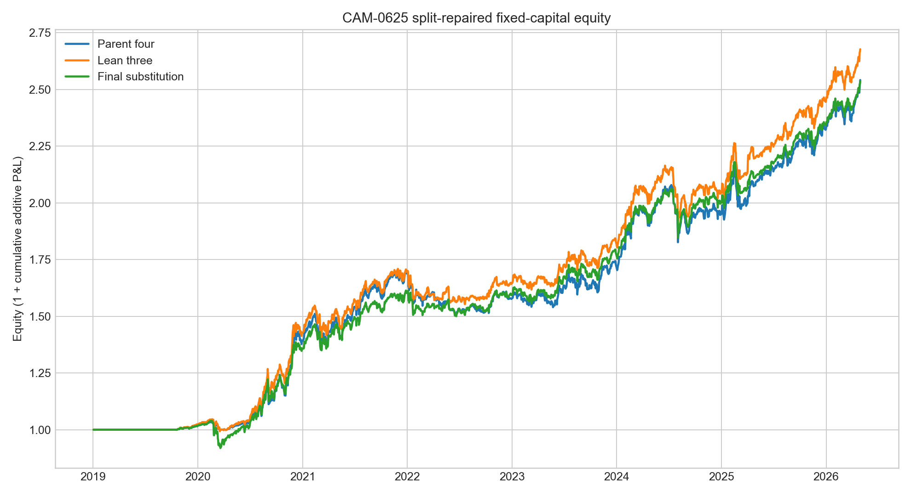
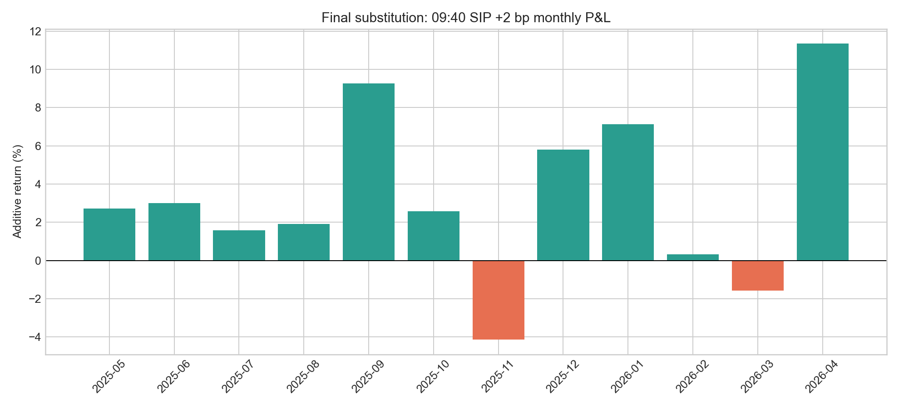

# SSRN 3247865 split-repaired deep-development report

## Executive verdict

The 25 requested paper sections were re-executed after discovering a material
data-integrity defect in the inherited stock panel. A 10-for-1 forward split
was applied as a 10x historical price multiplier rather than a 0.1x multiplier.
NVDA's June 2024 split consequently appeared as an approximately -99% overnight
return. Because the defect affected both cross-sectional ranks and held-position
returns, all earlier CAM-0600 through CAM-0625 strategy conclusions are invalid.
Their artifacts remain for audit; they are not evidence.

The repaired lineage is RUN-0020 (all 25 deep grids), RUN-0021 (six frozen
mechanism repairs), and RUN-0023 (target-change SIP replay). The semantic split
fixture now maps 1000 pre-split and 100 post-split to the same adjusted price.
NVDA's repaired pre/post adjusted opens are 119.77 and 120.37, a +0.50% return.

RUN-0024 subsequently audited every non-unit split multiplier in the corrected
QQQ and S&P panels. All 94 panel/symbol/date events were unique, no event retained
an absolute adjusted prior-close-to-event-open gap above 50%, and the maximum
residual gap was 4.45%. This closes the specific split-direction and duplicate-
multiplier failure mode, though it is not a blanket validation of every data field.

Under corrected data, 23 of 25 families have a structured development survivor;
pairs trading (3.8) and support/resistance (3.14) do not. All 23 survivors are
positive in the 2025-05-01 through 2026-04-30 09:40 SIP replay after an additional
2 bp per side. That is a useful development result, but not 23 independent edges:
many candidates share QQQ, momentum, trend, or optimizer identities.

Nothing is promoted. No row on or after 2026-05-01 was loaded.

## Repaired family checkpoint

Returns are fixed-capital additive, not compounded. “Quote” is exact marketable
SIP execution at target changes using the 09:30 midpoint as the delayed-price
reference plus 2 bp additional adverse slippage per side.

| Section | Family | Repaired selected expression | Full net / DD | Quote net / DD | Months +/− |
|---|---|---|---:|---:|---:|
| 3.1 | Price momentum | QQQ 252/21, top 3, trend + panic | +235.4% / 19.6% | +73.0% / 13.5% | 9/3 |
| 3.2 | Earnings momentum | QQQ SUE, 6-month overlap, price confirmation | +112.4% / 30.1% | +35.3% / 15.8% | 8/4 |
| 3.3 | Value | QQQ value-quality, top 10, trend | +138.7% / 23.9% | +64.3% / 6.3% | 9/3 |
| 3.4 | Low volatility | QQQ low-vol quality, top 20, trend | +93.1% / 22.1% | +25.2% / 7.0% | 8/4 |
| 3.6 | Multifactor | QQQ momentum-quality, top 5, trend | +113.4% / 25.6% | +37.1% / 14.7% | 8/4 |
| 3.7 | Residual momentum | S&P 500 residual momentum, top 10, trend | +52.7% / 17.6% | +37.3% / 8.7% | 9/3 |
| 3.8 | Pairs trading | No survivor | — | — | — |
| 3.9 | Single-cluster mean reversion | ETF long-cheap cluster expression | +304.9% / 22.0% | +25.1% / 30.0% | 8/4 |
| 3.9.1 | Multiple-cluster mean reversion | QQQ slow residual, top 10, monthly | +210.7% / 28.3% | +44.7% / 21.0% | 8/4 |
| 3.10 | Weighted-regression mean reversion | QQQ slow residual, top 10, monthly | +145.3% / 25.3% | +32.5% / 9.4% | 8/4 |
| 3.11 | One moving average | QQQ MA150 weekly momentum | +349.0% / 38.5% | +116.8% / 12.9% | 9/3 |
| 3.12 | Two moving averages | S&P 500 MA50/200 weekly momentum | +250.0% / 26.4% | +161.5% / 11.9% | 11/1 |
| 3.13 | Three moving averages | S&P 500 MA10/50/200 monthly momentum | +214.1% / 28.2% | +169.6% / 12.6% | 11/1 |
| 3.14 | Support and resistance | No survivor | — | — | — |
| 3.15 | Donchian channel | S&P 500 Donchian-100 reversal | +38.0% / 23.8% | +13.5% / 6.6% | 8/4 |
| 3.18 | Statistical-arbitrage optimization | QQQ positive optimizer sleeve | +111.5% / 27.8% | +18.1% / 12.6% | 9/3 |
| 3.18.1 | Dollar-neutral optimization | QQQ positive executable proxy | +111.6% / 26.9% | +17.7% / 13.2% | 8/4 |
| 3.20 | Alpha combos | ETF alpha combo, top 5 | +196.0% / 32.4% | +64.3% / 15.7% | 9/3 |
| 4.1 | Sector momentum | 252/21 weekly top 3 | +111.6% / 34.1% | +26.4% / 5.6% | 11/1 |
| 4.1.1 | Sector momentum + MA | 63-day monthly top 1 | +130.0% / 17.6% | +39.5% / 10.0% | 8/4 |
| 4.1.2 | Dual-momentum sector rotation | 63-day monthly top 1 | +117.9% / 16.9% | +35.9% / 9.3% | 8/4 |
| 4.4 | ETF IBS reversal | IBS30, top 5, hold 3, trend | +153.6% / 14.0% | +27.7% / 4.9% | 7/5 |
| 6.5 | Index volatility targeting | QQQ 15% target, defensive | +116.2% / 16.2% | +18.0% / 9.4% | 8/4 |
| 15.3 | Distress risk puzzle | QQQ safest top 5 | +196.2% / 22.7% | +76.2% / 9.7% | 9/3 |
| 15.3.1 | Distress risk management | QQQ safest top 5, 15% target | +114.0% / 15.1% | +32.8% / 6.6% | 9/3 |

The table is a survivor report, not a multiple-testing-adjusted discovery table.
CAM-0611 and CAM-0612 are related trend/momentum expressions; CAM-0615 and
CAM-0616 are near-duplicate executable positive sleeves; CAM-0608 and CAM-0609
converge on the same selected variant label. Counting them separately would
overstate independent evidence.

## Best repaired construction: CAM-0625 final substitution

The final construction equally weights four whole sleeves:

- CAM-0600 QQQ long-horizon momentum with trend/panic defense;
- CAM-0621 multi-day ETF IBS reversal;
- CAM-0624 volatility-managed safest-distress quality;
- CAM-0618 sector momentum rotation.

It replaces CAM-0604 because multifactor and distress had 0.80 daily correlation.
The sector sleeve was prespecified as the distinct replacement and construction
iteration stopped after the substitution test.

| Evidence | Net additive return | Max DD | Months +/− | Worst month | Top-five positive-day share |
|---|---:|---:|---:|---:|---:|
| Full repaired 2 bp history | +153.6% | 11.5% | 52/27 | −7.1% | 3.4% |
| 09:40 SIP +2 bp, latest 12 months | +40.0% | 7.25% | 10/2 | −4.1% | 12.2% |
| 09:40 SIP +10 bp, latest 12 months | +37.3% | 7.47% | 10/2 | −4.4% | — |
| 09:30 SIP +10 bp, latest 12 months | +37.5% | 7.69% | 10/2 | −4.6% | — |

Annual full-history returns are +33.9% (2020), +25.0% (2021), −1.4% (2022),
+18.8% (2023), +21.8% (2024), +34.2% (2025), and +19.5% through April 2026.
Fixed folds returned +58.9% in 2020–2021, +17.4% in 2022–2023, and +75.5%
in 2024 through April 2026. The recent regime is stronger, but the middle fold
remains positive and is not carried by one or two isolated days.

## Adversarial diagnostics

The corrected pre-2024 selection gate failed closed. Only CAM-0621 had a variant
meeting the frozen 60% green-month, 20% drawdown, and 252-active-day requirements.
The final four-family construction therefore was not prospectively identifiable
under that gate. It is adapted development evidence.

Two prespecified trailing-12-month activation monitors were rejected. They kept
the ensemble active throughout the quote year but worsened full-history drawdown
and reduced return. No regime overlay is retained.

A 20,000-path, 21-session-block bootstrap of 252-session paths gives median
+20.2%, 5th percentile −4.1%, and 1st percentile −14.6%. The 95th and 99th
drawdowns are 21.4% and 27.9%; 8.3% of paths lose money and 7.2% exceed 20%
drawdown. This directly rejects a risk-free “money printer” description.

The quote-period three-factor audit has correlations of 0.39 to SPY, 0.43 to
QQQ, and 0.44 to SMH; R² is 20.2%. The worst 5% of SPY days lose 17.1% of fixed
capital cumulatively. The positive residual intercept is encouraging, but the
strategy retains meaningful long-equity and technology downside.

The five largest individual quote-return leaders do not survive a concentration
audit as standalone printers. CAM-0611 and CAM-0612 correlate 0.87 and both have
SNDK as their largest contributor. The top five symbols supply 72%–91% of
positive quote P&L across CAM-0612, CAM-0611, CAM-0610, CAM-0623, and CAM-0600.
Removing those five cuts net return to +7.6%, +27.8%, +22.3%, +16.8%, and +3.5%,
respectively. None of the five families has an eligible pre-2024 variant under
the frozen quality gate. SNDK price history begins 2025-02-13 and point-in-time
S&P membership begins 2025-11-28, so its contribution is causal but still a
large recent winner, not broad evidence.

The final four-sleeve construction is better diversified by symbol. It has 30
profitable and nine losing symbols; APP supplies 13.5% of positive P&L and the
top five supply 52.1%. Removing the top five leaves +18.1% quote net. A frozen
10% symbol-cap test, leaving excess in cash, improves quote return/drawdown to
+40.7%/6.26% but reduces top-five share only to 51.2% and lowers full-history
return to +141.5%. Because the concentration improvement is immaterial, the cap
is not selected as the primary construction.

Sleeve-level dependence is moderate rather than negligible. In the quote year,
pairwise daily correlations range from 0.50 to 0.77. The ensemble remains
profitable after removing any sleeve: excluding CAM-0600 leaves +29.0% net with
5.06% drawdown, while the other leave-one-out paths return +42.3% to +44.5%.
The strongest sleeve supplies a median 59.0% of positive monthly sleeve
contribution, exceeding 75% in two of 11 months having any positive sleeve.
This supports diversification relative to the standalone leaders, but not an
independence claim or an after-the-fact sleeve reweighting.

## Execution and data integrity

RUN-0023 uses target-change, marketable SIP sides rather than charging a daily
round trip to multi-day holdings. Buys cross the ask, sells cross the bid, and
09:40 entries are measured against the 09:30 midpoint. Missing roles are never
imputed. The lowest selected-family 09:40 role coverage is 99.94%.

The quote lake is a role-centered archive, so newly selected roles were matched
against saved artifacts and then pulled from Alpaca only for the uncovered
remainder. The remote pulls used 5-, 30-, and 120-second bounded windows, recorded
no credentials, and loaded zero holdout rows. RUN-0022 is preserved as invalid
because its remainder tool initially counted null-quote rows as matched keys;
RUN-0023 repairs that accounting.

## Decision

CAM-0625 is the best repaired recent-regime lead and is suitable for unchanged
forward paper tracking at small scale. It is not ready for capital or sealed-
holdout evaluation. Promotion is blocked by adaptive selection, failure of the
pre-2024 family gate, correlated momentum/technology exposure, and negative
bootstrap tails. CAM-0606 and CAM-0613 are exhausted under the tested mechanisms;
the other family survivors remain research leads, not 23 deployable strategies.

Reproducibility tables are in
`artifacts/shared/split_repaired_25_strategy_checkpoint.csv`; exact run configs,
daily P&L, quote paths, invalid attempts, and execution reports are preserved in
RUN-0020/RUN-0021/RUN-0023 and CAM-0625 RUN-0017 through RUN-0024.
The post-checkpoint concentration and sleeve-dependence audits are preserved in
CAM-0625 RUN-0025 through RUN-0029.
